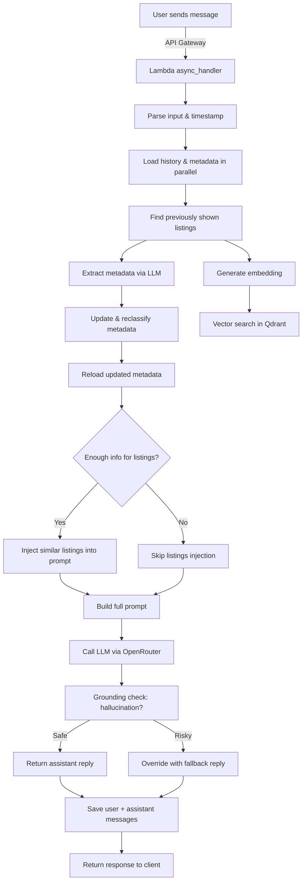

This is a cleaned and published version of a private repo, containing only the final version for demonstration purposes.

# Real Estate Chat Assistant (LLM-Powered)

This project is a serverless, real-time chat assistant powered by LLMs and a RAG. It guides users through listings, extracts structured preferences from natural language, and returns grounded suggestions from a vector database.

---

## 🚀 High-Level Flow

---

## 🧠 Features

- 🧾 **Metadata Extraction**: Parses budget, location, urgency, and other criteria from user messages via LLM prompt.
- 📌 **Contextual Memory**: Persists user preferences and chat history using DynamoDB.
- 🧮 **Semantic Search**: Computes vector embeddings from user messages and queries Qdrant for similar properties.
- 🔐 **Grounded Reasoning**: Ensures assistant only refers to known listings; blocks hallucinations.
- 🛠️ **Schema-Driven**: Field types, weights, prompts, and labels all configured via domain-specific schema in S3.
- ⚡ **Fully Asynchronous**: Parallel I/O operations for maximum performance.
- 🧪 **Cold Start Tracking**: Logs Lambda cold start duration for performance insight.

---

## 🗂️ Core Modules

| Module/Function | Purpose |
|-----------------|---------|
| `async_handler` | Main Lambda logic: parses, processes, responds |
| `call_openrouter` | Sends prompt to LLM and gets response |
| `extract_metadata_from_user_message` | Uses LLM to extract structured preferences |
| `classify_lead` | Assigns "Hot/Warm/Cold" based on scoring schema |
| `get_similar_items` | Searches Qdrant for similar vectors |
| `build_prompt_or` | Constructs prompt for OpenRouter with listings and metadata |
| `is_reply_grounded` | Validates if assistant's response refers only to known listings |
| `save/load_metadata` | Handles persistent user preferences in DynamoDB |
| `sanitize_*/validate_metadata` | Cleans, validates, and normalizes user data |

---

## 🪵 Logging & Debugging

- Logs timing of every critical step (embedding, prompt, LLM response, etc.)
- Flags hallucinated responses with a warning and fallback
- Logs cold start duration (for Lambda performance tuning)

---

## 📦 Deployment

- Python runtime in AWS Lambda
- Asynchronous boto3/HTTP clients (aioboto3, httpx)
- Prompt templates and schema stored in S3 (domain-separated)
- Vector search powered by Qdrant (hosted in AWS Fargate or EC2)
- LLMs accessed via OpenRouter (Claude, GPT, etc.) or Amazon Bedrock

---

## ✅ Requirements

- Python 3.9+
- AWS Lambda + API Gateway
- Qdrant vector DB
- OpenRouter or Bedrock API key
- S3 bucket with domain schema and prompt templates

---

## 👷 Future Improvements

- Add retry/circuit-breaker logic to OpenRouter calls
- Integrate response classification + lead scoring dashboard
- Role-based visibility (e.g., agents vs buyers)

---

## 👋 Author & Credits

Built by [Alberto Zuin](https://moyd.co.uk) as part of an AI-driven RAG POC. Powered by Bedrock, OpenRouter, Qdrant, and AWS serverless tools.

---

